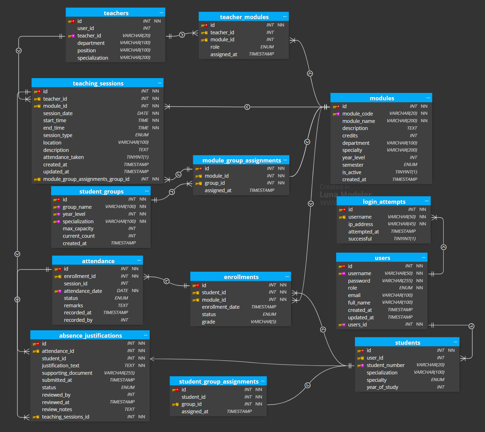

#  PAW Attendance Management System

**University Attendance Tracking System for Teachers and Students**

A modern, web-based attendance management system built with PHP and MySQL, designed for educational institutions to efficiently track and manage student attendance.

##  What This System Does

This attendance management system provides a complete solution for:

- **Teachers**: Create sessions, mark attendance, and generate reports
- **Students**: View attendance records and track progress
- **Administrators**: Manage users, modules, and system oversight

##  Key Features

### For Teachers 
- **Session Management**: Create and manage teaching sessions for assigned modules
- **Attendance Marking**: Easy-to-use interface for marking student attendance
- **Real-time Reports**: Generate attendance summaries and statistics
- **Module-based Access**: Only access modules you're assigned to teach

### For Students 
- **Attendance Tracking**: View personal attendance records
- **Progress Monitoring**: Track attendance percentages by course
- **User-friendly Dashboard**: Clean interface showing attendance status

### For Administrators 
- **Complete System Control**: Manage all users, modules, and system settings
- **User Management**: Create and manage teacher and student accounts
- **Module Assignment**: Assign teachers to specific modules
- **System Analytics**: Comprehensive statistics and reports

## 💻 Technology Stack

- **Backend**: PHP 7.4+
- **Database**: MySQL 5.7+
- **Frontend**: HTML5, CSS3, JavaScript
- **Framework**: Bootstrap 5 for responsive design
- **Icons**: Font Awesome for modern UI elements

##  Installation & Setup

### Prerequisites
- WAMP/XAMPP or similar local server environment
- PHP 7.4 or higher
- MySQL 5.7 or higher
- Modern web browser

### Quick Setup

1. **Clone or Download** this project to your web server directory

2. **Database Setup**:
   - Navigate to `http://localhost/pawproject/setup_database.php`
   - Click "Setup Database" to create tables and sample data

3. **Configuration**:
   - Update database settings in `includes/config.php` if needed
   - Default settings work with standard WAMP/XAMPP installations

4. **Access the System**:
   - Visit `http://localhost/pawproject/`
   - Use demo accounts to explore the system

##  Demo Accounts

| Role | Username | Password | Access |
|------|----------|----------|--------|
| **Admin** | admin | admin123 | Full system access |
| **Teacher** | prof.kowalski | 123456 | Session & attendance management |
| **Student** | soumia.lahlou | 123456 | Attendance viewing |

##  Project Structure

```
pawproject/
├── admin/                 # Administrator interface
│   ├── dashboard.php      # Admin main dashboard
│   ├── student_management.php
│   ├── teacher_management.php
│   └── module_management.php
├── teacher/              # Teacher interface
│   ├── dashboard.php     # Teacher main dashboard
│   ├── sessions.php      # Session management
│   ├── mark_attendance.php # Attendance marking
│   └── attendance_summary.php # Reports
├── student/              # Student interface
│   └── dashboard.php     # Student dashboard
├── auth/                 # Authentication system
│   ├── login.php         # Login page
│   ├── logout.php        # Logout handler
│   └── session_check.php # Session validation
├── includes/             # Core system files
│   ├── config.php        # Database configuration
│   └── admin_navbar.php  # Shared navigation
├── components/           # Reusable UI components
├── css/                  # Stylesheets
├── setup_database.php    # Database setup utility
└── index.html           # Landing page
```

##  How to Use

### For Teachers
1. **Login** with your teacher credentials
2. **Dashboard**: View your assigned modules and recent sessions
3. **Sessions**: Create new teaching sessions for your modules
4. **Mark Attendance**: Take attendance during class sessions
5. **Reports**: Generate attendance summaries and statistics

### For Students
1. **Login** with your student credentials
2. **Dashboard**: View your attendance status across all enrolled modules
3. **Track Progress**: Monitor your attendance percentages

### For Administrators
1. **Login** with admin credentials
2. **Manage Users**: Create and manage teacher/student accounts
3. **Module Management**: Create modules and assign teachers
4. **System Overview**: Monitor overall system statistics

##  Security Features

- **Secure Authentication**: Password hashing with PHP's built-in functions
- **Session Management**: Proper session handling and timeout
- **Role-based Access**: Users only access appropriate features
- **SQL Injection Protection**: Prepared statements throughout
- **Input Validation**: Server-side validation for all forms

##  Database Schema

The system uses a well-structured MySQL database with the following key tables:

### Entity Relationship Diagram


### Key Tables
- **users**: System users (admin, teachers, students)
- **modules**: Course modules/subjects
- **teacher_modules**: Teacher-module assignments
- **groups**: Student groups/classes
- **enrollments**: Student enrollment in modules
- **teaching_sessions**: Individual class sessions
- **attendance**: Attendance records

## 🎨 UI/UX Design

The system features a modern, intuitive interface designed with user experience in mind:

### Design Prototype

<div align="center">

## 🎨 **[VIEW INTERACTIVE DESIGN PROTOTYPE →](https://www.figma.com/design/kHJcp5XEVurUaMDZM4QHRG/paw-project?node-id=0-1&t=A4H695Kfsf4Ck9BS-1)**

</div>

*Click above to explore the complete UI/UX design and user flow on Figma*

## 🛠 Customization

The system is designed to be easily customizable:

- **Styling**: Modify CSS files in `/css/` directory
- **Components**: Reusable components in `/components/`
- **Configuration**: Database and system settings in `/includes/config.php`
- **Branding**: Update logos and branding in templates

## 📈 Features Implemented

✅ **Complete Authentication System**
- User login/logout with role-based redirection
- Secure session management
- Password protection

✅ **Teacher Functionality**
- Module-based access control
- Session creation and management
- Real-time attendance marking
- Attendance reports and summaries

✅ **Student Dashboard**
- Personal attendance viewing
- Module-wise attendance tracking
- Clean, responsive interface

✅ **Administrative Tools**
- User management (teachers/students)
- Module management and assignment
- System statistics and oversight

✅ **Database Management**
- Automated setup script
- Sample data generation
- Relationship integrity

✅ **Responsive Design**
- Mobile-friendly interface
- Modern UI with Bootstrap
- Consistent styling across all pages

##  Academic Context

**Course**: Programmation Avancée Web (PAW)
**Institution**: University Project
**Purpose**: Demonstrate full-stack web development skills

This project showcases:
- PHP backend development
- MySQL database design
- Frontend integration
- Security best practices
- User experience design

##  Support

For questions or issues:
1. Check the database setup is correct
2. Verify all files are properly uploaded
3. Ensure PHP and MySQL services are running
4. Check browser console for any JavaScript errors

---

**Built with 💻 for educational attendance management**